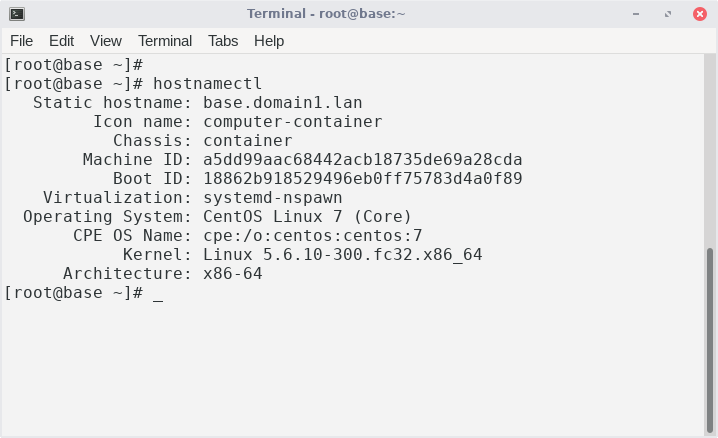
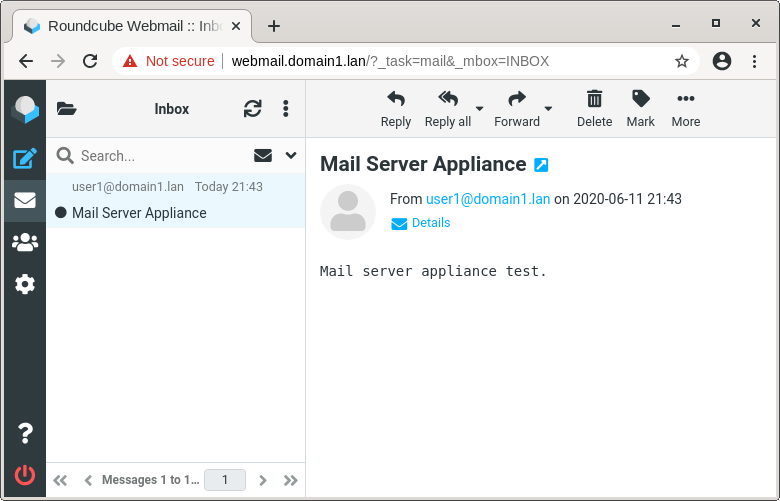

# Linux Software Appliances

Linux software appliance is composed of minimal Linux operating system with pre-installed ready to use software applications.

This software appliances are used with systemd-nspawn technology that create light-weight container and virtualize file system and processes.

**Features:** 
- Ready to use copy paste software applications
- Folder container with operating system and applications
- Can be used anywhere Linux is installed, in cloud, in virtual machine
- Use full performance of the host, CPU, memory, disk

**Website:** \
[https://ivoprogram.github.io](https://ivoprogram.github.io)

**Download:** \
[Base Appliance: centos7.base-2020-06-10.tar.gz](https://github.com/ivoprogram/linuxapp/releases/download/base/centos7.base-2020-06-10.tar.gz)\
[DNS Server Appliance: centos7.dns-2020-06-10.tar.gz](https://github.com/ivoprogram/linuxapp/releases/download/dns/centos7.dns-2020-06-10.tar.gz)

**Installation:** 
<pre>
# Install systemd-container 
sudo yum install systemd-container 
sudo systemctl enable machines.target
sudo systemctl start machines.target

# Download
wget https://github.com/ivoprogram/linuxapp/releases/download/base/centos7.base-2020-06-10.tar.gz

# Extract to folder
sudo mkdir /opt/linuxapp
sudo tar -xf centos7.base-2020-05-12.tar.gz -C /opt/linuxapp/
sudo semanage fcontext -a -t svirt_sandbox_file_t "/opt/linuxapp/centos7.base(/.*)?"
sudo restorecon -R /opt/linuxapp/centos7.base

# Start appliance for test
sudo systemd-nspawn -bD /opt/linuxapp/centos7.base
user: root
pass: root

# Exit container
Ctrl+]]]

# Configure systemd-nspawn
sudo vi /etc/systemd/system/systemd-nspawn@.service
ExecStart=/usr/bin/systemd-nspawn --quiet --boot --settings=override –machine=%i

# Create link to container
sudo ls -l /var/lib/machines
sudo ln -s /opt/linuxapp/centos7.base /var/lib/machines/centos7.base

# Enable and start appliance service
sudo systemctl enable systemd-nspawn@centos7.base
sudo systemctl start systemd-nspawn@centos7.base

# Use appliance
ssh root@127.0.0.1 -p 55522
pass: root

</pre>

**Requirements for the host:** 
- CentOS 7 or more
- Fedora 30 or more
- systemd-container package

